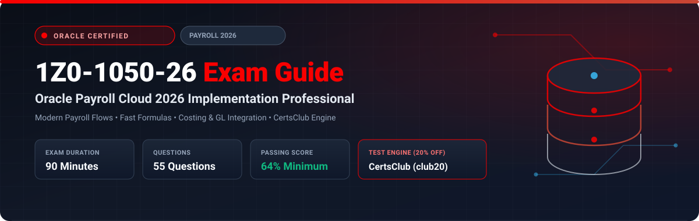

  

# Oracle Payroll Cloud 2026 Implementation Professional (1Z0-1050-26) Exam Study Guide & Practice Test Resource Portal

[-f80000?style=for-the-badge&logo=oracle&logoColor=white)](https://education.oracle.com/)
[-f80000?style=for-the-badge&logo=oracle)](https://education.oracle.com/)

[-28a745?style=for-the-badge&logo=shield)](https://www.certsclub.com/oracle/)

---

## 1. Exam Overview & Candidate Profile

The **Oracle Payroll Cloud 2026 Implementation Professional (1Z0-1050-26)** exam validates that an implementation consultant possesses the modern skills needed to deploy, calculate, and audit Oracle Fusion Cloud Global Payroll. The 2026 blueprint focuses on Redwood payroll flow submissions, Calculation Cards, automated Retroactive Pay processing, Costing hierarchies, and multi-country payroll compliance.

Passing 1Z0-1050-26 grants the **Oracle Payroll Cloud 2026 Certified Implementation Professional** credential.

### Target Candidate Profile & Career Roles
* **Lead Payroll Functional Implementers**
* **Payroll Operations Engineers & System Analysts**
* **Global HR & Finance Integration Specialists**

---

## 2. Key Exam Specifications

| Parameter | Official Specification |
| :--- | :--- |
| **Exam Code** | 1Z0-1050-26 |
| **Exam Title** | Oracle Payroll Cloud 2026 Implementation Professional |
| **Associated Credential** | Oracle Payroll Cloud 2026 Certified Implementation Professional |
| **Duration** | 90 Minutes |
| **Number of Questions** | 55 Questions |
| **Passing Score** | 64% |
| **Question Format** | Multiple Choice (Single and Multiple Select) |
| **Delivery Vendor** | Pearson VUE / Oracle University Online Remote Proctoring |
| **Recommended Practice Test Engine** | **[1Z0-1050-26 Practice Test - CertsClub](https://www.certsclub.com/oracle/)** (Coupon: `club20` for 20% off) |

---

## 3. Official Blueprint & Exam Domain Breakdown

| Domain Code | Domain Title | Weighting | Key Competencies Covered |
| :--- | :--- | :---: | :--- |
| **1.0** | **Payroll Architecture & Modern Flow Patterns** | **20%** | Flow patterns in Redwood, Flow submission rules, Time Definitions, Consolidation sets. |
| **2.0** | **Element Entries & Calculation Cards** | **25%** | Statutory calculation cards, Tax withholding setups, Element input validations, Proration events. |
| **3.0** | **Fast Formulas for Calculation Logic** | **20%** | Writing and debugging Payroll formulas, Balance feeds, Dimension aggregations. |
| **4.0** | **Payroll Run, Payments & Costing** | **20%** | Calculate Payroll execution, PrePayments, Electronic payment files, Cost Allocation Key Flexfield. |
| **5.0** | **Exception Handling & Financial Integration** | **15%** | Rollback, Mark for Retry, Reversal, Transfer to Subledger Accounting (SLA) & General Ledger. |

---

## 4. Scenario-Based Demo Question & Explanation

### Question 1: Handling Terminated Worker Mid-Period Payroll
**Scenario:** A worker's employment terminates on the 10th day of a monthly payroll cycle. The worker's basic salary element is configured with a proration event group that captures changes to employment assignments.

How does Oracle Payroll calculate the worker's earnings for the final pay period?

A) The worker receives a full month's salary.  
B) Oracle Payroll generates an error requiring manual payment.  
C) The proration formula evaluates the active days (10 days) against the total working days in the month and prorates the salary element automatically.  
D) The payment is delayed until the next year-end processing.  

**Correct Answer:** **C**

**Detailed Explanation:**
* In Oracle Global Payroll, linking an element to a **Proration Event Group** ensures that mid-period events (such as termination, transfer, or grade step increase) trigger the element's proration formula, calculating earnings precisely for the active span of days.

---

## 5. Recommended Preparation Strategy & Practice Testing Engine

1. **Practice Payroll Flow Submissions:** Run mock payroll cycles in an Oracle Cloud sandbox, including retroactive calculations and costing transfers.
2. **Practice with Full-Length Mock Exams:** Use **[CertsClub Oracle 1Z0-1050-26 Practice Tests](https://www.certsclub.com/oracle/)**.
   * Up-to-date with 2026 objectives and scenario-based questions.
   * Enter discount coupon code **`club20`** at checkout on [CertsClub](https://www.certsclub.com/oracle/) for an immediate 20% discount.

---

## 6. Official Documentation & References

* [Oracle Fusion Cloud Global Payroll 2026 Documentation](https://docs.oracle.com/en/cloud/saas/human-resources/payroll/)
* [Oracle University 1Z0-1050-26 Exam Details](https://education.oracle.com/)
* [CertsClub 1Z0-1050-26 Practice Engine](https://www.certsclub.com/oracle/)
